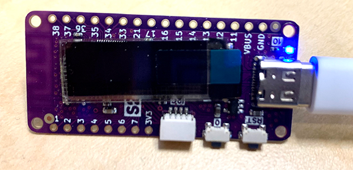

# ESP32-S2-Pico-Blink
lolin esp32 s2 pico LED blinker

Lolin has released a sweet little update to their previdous D1 mini boards. The new boards have an OLED screen and can CircuitPython installed on them. (They come with Micro Python installed.)

I was frustrated because I couldn't even get the blue status LED to blink when I got everything from Adafruit put on the board. 

It turns out, I just needed to get the GPIO 10 used properly.

The Lolin ESP32 S2 Pico  https://www.aliexpress.com/item/1005003215673294.html

Adafruit CircuitPython  https://circuitpython.org/

Installation and Libraries for the board  https://circuitpython.org/board/lolin_s2_pico/

Use the ESPTool to install on your board  https://adafruit.github.io/Adafruit_WebSerial_ESPTool/

